# 🏥 Mediroza General Hospital — Penetration Test Report


**Prepared by:** Samuel Ntuen
**Organisation:** Networkwalks Internship Programme
**Target:** https://medirozahospital.com
**Date:** September 2026
**Classification:** Confidential — Authorised Personnel Only

---

## 📋 Executive Summary

Mediroza General Hospital engaged Networkwalks to perform a full black-box penetration test against their public-facing web infrastructure. The assessment was carried out by Samuel Ntuen over a three-day period in September 2026, with written authorisation granted by the client prior to any testing activity.

The assessment revealed critical security vulnerabilities that when chained together allowed complete unauthorised access to confidential patient records, staff salary information, shareholder data, and sensitive medical information. None of these actions required advanced tooling — they were achieved using standard, widely-available security tools and publicly documented techniques.

---

## 🚨 Summary of Findings

| # | Finding | Severity | CVSS |
|---|---|---|---|
| 1 | SQL Injection — Authentication Bypass | 🔴 CRITICAL | 9.8 |
| 2 | Exposed Database Backup File | 🔴 CRITICAL | 9.1 |
| 3 | Weak PDF Encryption Passwords | 🟠 HIGH | 7.5 |
| 4 | Sensitive Path Disclosure via robots.txt | 🟡 MEDIUM | 5.3 |
| 5 | Directory Listing Enabled | 🟡 MEDIUM | 5.3 |
| 6 | Username Enumeration on Login Form | 🟡 MEDIUM | 5.3 |
| 7 | Verbose SQL Error Messages Exposed | 🟢 LOW | 3.1 |

---

## 🔭 Scope and Methodology

| Parameter | Details |
|---|---|
| **Target URL** | https://medirozahospital.com |
| **Assessment Type** | Black-Box Penetration Test |
| **Scope** | Target domain only |
| **Rules** | No social engineering. No DoS. No testing outside scope |
| **Authorisation** | Written permission granted by client |
| **Duration** | 3 Days — September 2026 |

### Methodology Phases:
1. **Passive Reconnaissance** — WHOIS, DNS enumeration
2. **Active Reconnaissance** — Nmap, Gobuster, directory enumeration
3. **Vulnerability Identification** — SQL Injection, directory listing
4. **Exploitation** — Authentication bypass, PDF cracking, database extraction
5. **Reporting** — Documentation of all findings with evidence

---

## 🛠️ Tools Used

| Tool | Purpose |
|---|---|
| Nmap | Port scanning and service detection |
| Gobuster | Directory and file enumeration |
| Firefox | Manual web application testing |
| John the Ripper | PDF password hash cracking |
| Networkwalks Password Cracker | Browser-based hash cracking |
| ExifTool | PDF metadata analysis |
| pdf2john | PDF hash extraction |
| wget | File downloading |
| sqlmap | SQL injection testing |

---

## ⚔️ Attack Walkthrough

### 🔴 MILESTONE 1 — Initial Access: Patient Portal Breach

#### Step 1: Reconnaissance
Active reconnaissance was performed against medirozahospital.com using Nmap to identify open ports and running services.

**Command used:**
```bash
nmap -Pn -sV -sC medirozahospital.com
```

**Results:**
- IP Address: 199.188.201.16
- Port 80/443: Open — OpenResty 1.31.1.1
- Port 587: Open — Exim smtpd 4.99.5
- Web Server: OpenResty (nginx-based)

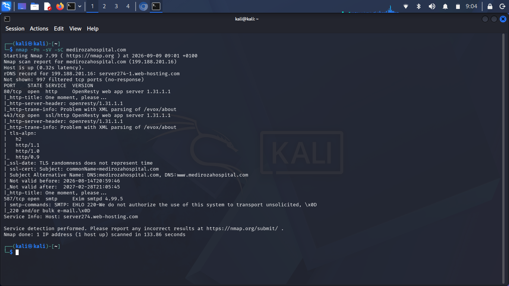

---

#### Step 2: Directory Enumeration
Gobuster was used to enumerate hidden directories. The robots.txt file was also reviewed and revealed three sensitive directories:
- `/patient/` — Patient portal
- `/staff/` — Staff portal
- `/old/` — Old files directory

Directory listing was found enabled at `/patient/` exposing the full file structure including `login.php`, `portal.php`, `download.php` and `error_log`.

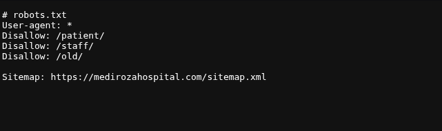

---

#### Step 3: SQL Injection Discovery
The patient portal login form at `/patient/login.php` was tested for SQL Injection. Entering a single quote `'` in the username field returned the following verbose MySQL error:

**Error returned:**

Warning: mysqli_query(): You have an error in your SQL
syntax; check the manual that corresponds to your MySQL
server version for the right syntax to use near
'' OR 1=1--' at line 1


This confirmed the application was vulnerable to SQL Injection and was using MySQL as its database.

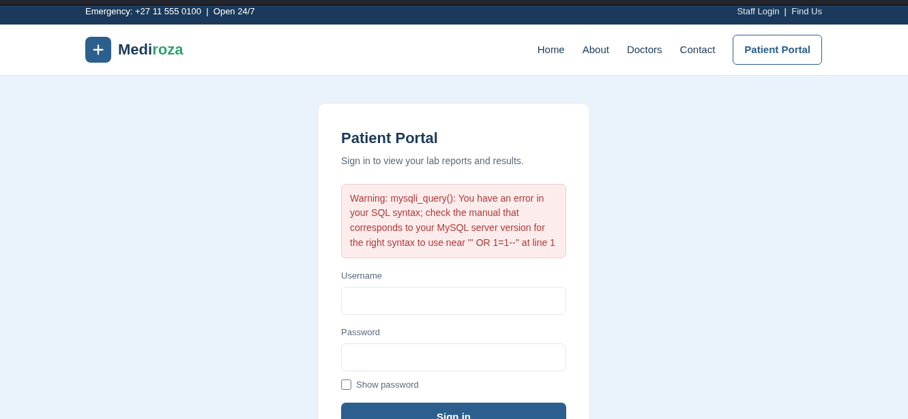

---

#### Step 4: Authentication Bypass
The following SQL Injection payload was used to bypass authentication:

Username: admin'--
Password: anything


**Result:** Full unauthorized access to the patient portal was achieved. Three confidential pathology lab reports were exposed:

| Patient | Lab Ref | Date |
|---|---|---|
| Sipho Dlamini | LR-2024-1187 | 2024-11-04 |
| Priya Reddy | LR-2024-1192 | 2024-11-05 |
| Emily Thompson | LR-2024-1205 | 2024-11-06 |

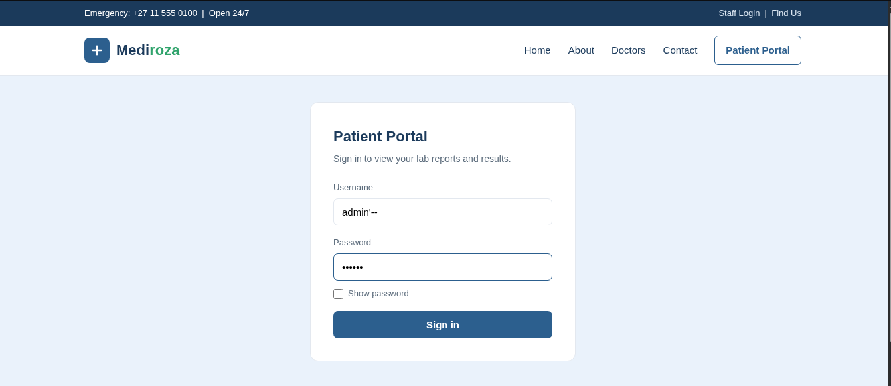
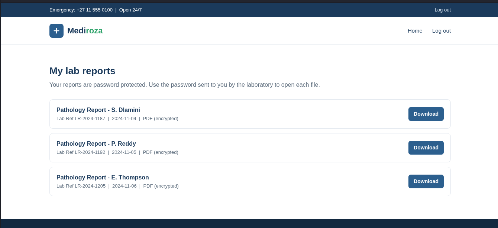

---

### 🟠 MILESTONE 2 — PDF Password Cracking

#### Step 5: Hash Extraction
PDF hashes were extracted from all 3 patient reports using pdf2john and the Networkwalks Online Hash Extractor.

```bash
pdf2john patient_report_1.pdf > hash1.txt
pdf2john patient_report_2.pdf > hash2.txt
pdf2john patient_report_3.pdf > hash3.txt
```

---

#### Step 6: Password Recovery
All 3 PDF passwords were successfully cracked using John the Ripper and the Networkwalks Password Cracker:

| File | Patient | Password | Strength |
|---|---|---|---|
| patient_report_1.pdf | Sipho Dlamini | `123456` | ❌ Extremely Weak |
| patient_report_2.pdf | Priya Reddy | `password` | ❌ Extremely Weak |
| patient_report_3.pdf | Emily Thompson | `!@#$%^&` | ⚠️ Medium |

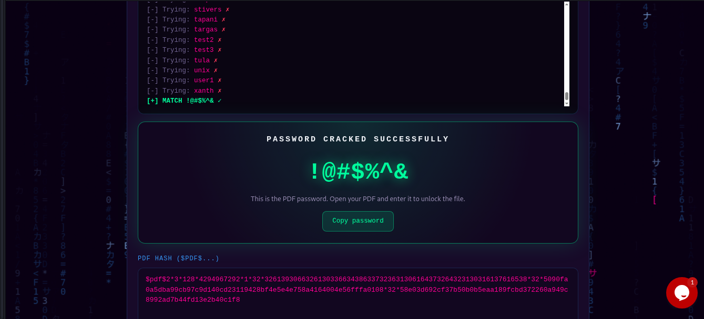

---

#### Step 7: Patient Records Accessed
All 3 confidential pathology reports were successfully opened and their contents accessed:

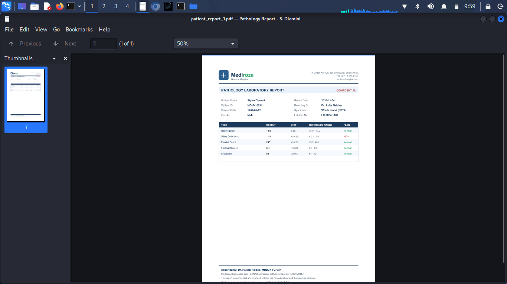
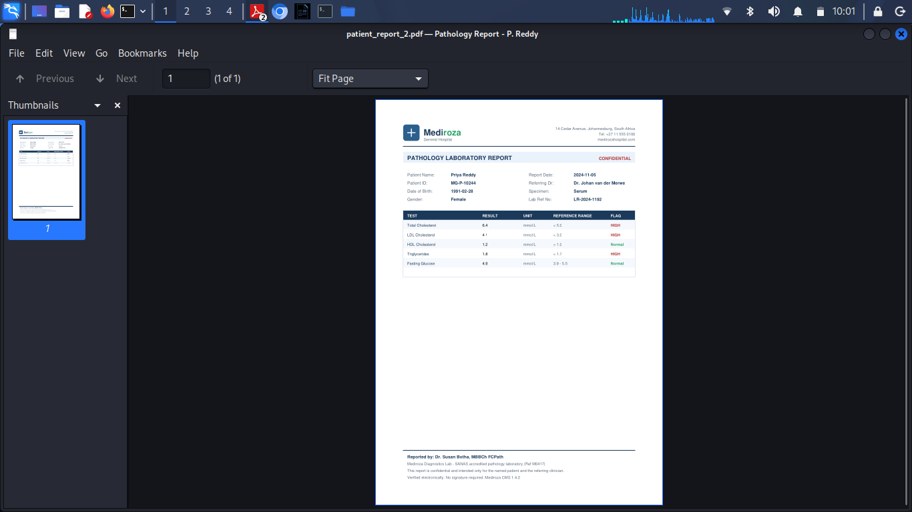
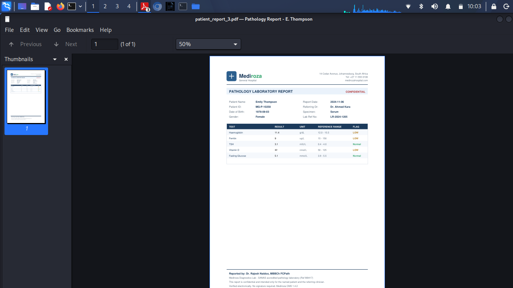

---

### 🔴 MILESTONE 3 — Critical Data Exposure

#### Step 8: Metadata Analysis
ExifTool was run against all 3 PDFs. A critical finding was discovered in patient_report_3.pdf:

```bash
exiftool -password '!@#$%^&' patient_report_3.pdf
```

**Critical metadata found:**

Author : j.malik
Comments : DB backup moved to /old before site
migration, do not delete

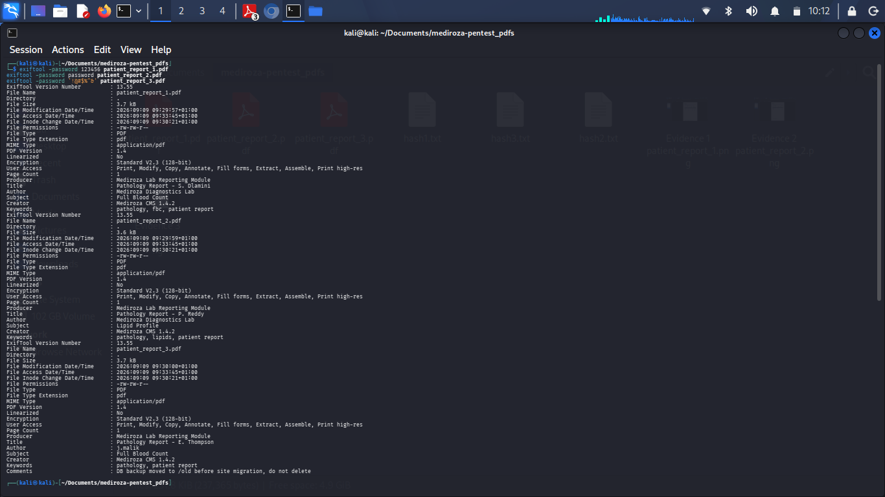

---

#### Step 9: Database Backup Discovery
Acting on the metadata comment, the following URL was accessed:

https://medirozahospital.com/old/


A publicly accessible database backup was found with no authentication required:

mediroza_db_backup_2019.sql — 7KB
Last Modified: 2026-09-04


```bash
wget https://medirozahospital.com/old/mediroza_db_backup_2019.sql
```

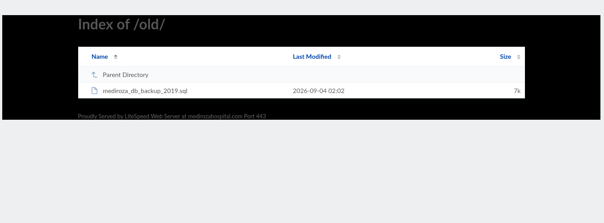

---

#### Step 10: Critical Data Extracted

**Staff Table — 30 Employees exposed:**

| Name | Role | Monthly Salary |
|---|---|---|
| Dr. Johan van der Merwe | Medical Director | R160,000 |
| Sarah Botha | Chief Financial Officer | R152,000 |
| Dr. Rajesh Naidoo | Chief Pathologist | R138,000 |
| Dr. Vikram Chetty | Anaesthetist | R135,000 |
| Dr. Suresh Moodley | Radiologist | R130,000 |
| Linda Fourie | Receptionist | R19,000 |
| Andile Mbeki | Ward Clerk | R21,000 |

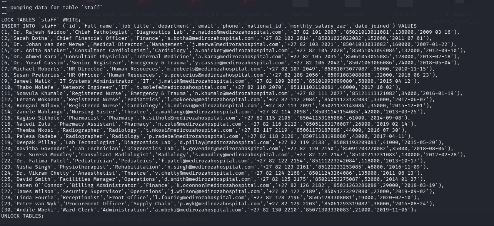

**Shareholders Table — 10 Shareholders exposed:**

| Shareholder | Share % | Shares Held | Class |
|---|---|---|---|
| Dr. Rajesh Naidoo | 18% | 180,000 | Ordinary |
| Cedar Health Holdings | 15% | 150,000 | Ordinary |
| Dr. Johan van der Merwe | 12% | 120,000 | Ordinary |
| Reddy Family Trust | 11% | 110,000 | Ordinary |
| Thabo Molefe | 10% | 100,000 | Ordinary |
| Dr. Ahmed Kara | 8% | 80,000 | Preferential |
| Dr. Vikram Chetty | 4% | 40,000 | Preferential |

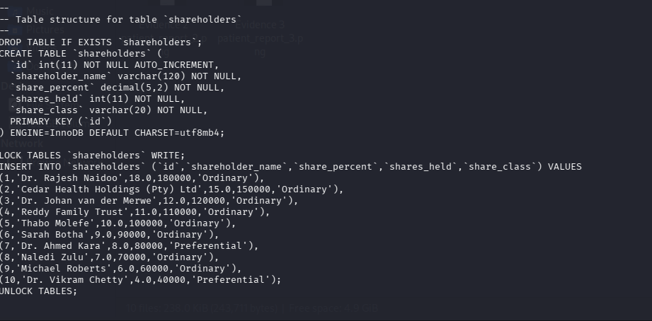

---

## 🛡️ Remediation Summary

### 🔴 Immediate (24-48 Hours):
- Fix SQL Injection using prepared statements
- Remove `/old/mediroza_db_backup_2019.sql` immediately
- Disable verbose MySQL error messages in production

### 🟠 Short Term (1-2 Weeks):
- Enforce strong PDF password policy (12+ characters)
- Remove sensitive paths from robots.txt
- Implement generic error messages on login form

### 🟡 Medium Term (1 Month):
- Disable directory listing on all server directories
- Implement Web Application Firewall (WAF)
- Add multi-factor authentication to all portals

### 🟢 Long Term (Ongoing):
- Annual penetration testing
- Security awareness training for all staff
- Implement Secure Development Lifecycle (SDLC)
- Establish incident response plan

---

## 📚 What I Learned

- How **SQL Injection** works and how to exploit it ethically
- How to conduct a full **black-box penetration test**
- How to extract and crack **PDF password hashes**
- How **PDF metadata** can leak sensitive server information
- How exposed **database backups** create critical security risks
- How to write a **professional penetration testing report**
- How multiple vulnerabilities **chain together** to cause a breach
- Real-world impact on **patient data privacy and POPIA compliance**

---

## ⚠️ Disclaimer

This penetration test was conducted with full written authorisation from Mediroza General Hospital as part of the Networkwalks Cybersecurity Internship Programme. All findings are documented for educational and remediation purposes only. These techniques must never be applied to any system without explicit written permission from the owner.

---

👤 **Author**/**Tester:** 

**Samuel M. Ntuen**

Cybersecurity Intern — Batch: **B082-NetworkWalks**

LinkedIn: *https://www.linkedin.com/in/samuelntuen/*

